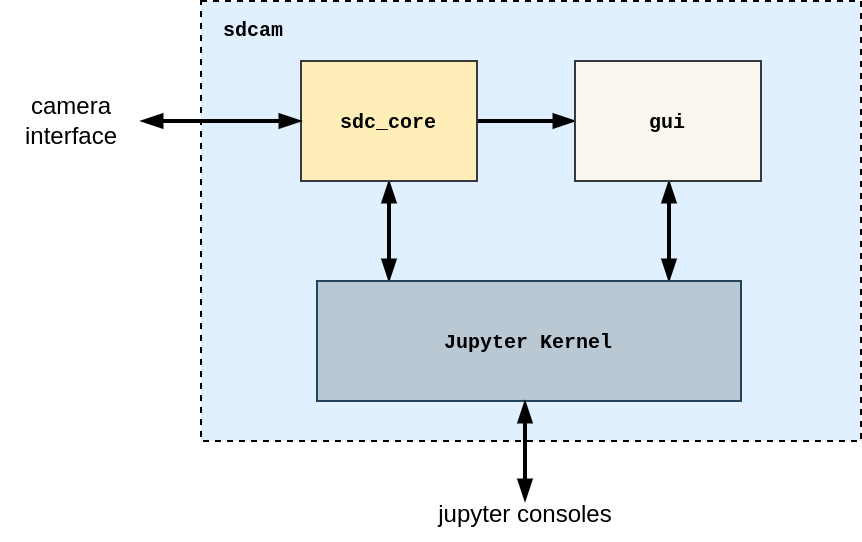
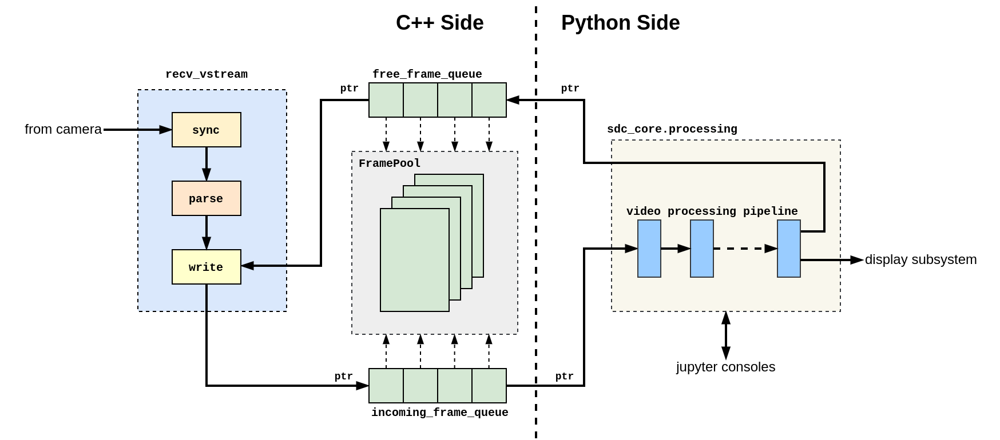

# Архитектура программы

## Общие сведения, состав и организация

Программа разработана с использованием языков программирования (ЯП) **Python** и **C++**. Основным языком является **Python**, а **С++** используется для повышения эффективности&nbsp;– все затратные с точки зрения производительности операции реализованы на **C++** как функции расширения основной программы на **Python**. 

Программа построена с применением фреймворка **Qt** версии 5, точнее его биндинга **PyQt5**, который активно используется для организации графического интерфейса пользователя&nbsp;– GUI (Graphic User Interface). 

!!! warning "**ВАЖНОЕ ЗАМЕЧАНИЕ**"

    Отличительной особенностью программы является то, что в ней в качестве ядра приложения используется **Jupyter Kernel**, представляющий собой ядро приложения **IPython**&nbsp;– это позволяет легко подключать к нему любые части программы, написанные на **Python**, и иметь полный контроль над ними, включая мониторинг, инспекцию и управление **во время выполнения**. Все эти возможности реализуются посредством **IPython** консоли, подключаемой к ядру программы.

    Это открывает широчайшие возможности как для отладки самой программы, так и, самое главное, **для эффективной работы с данными видеопотока и самим прибором**: через развитую, богатую возможностями консоль можно легко получить доступ к любым объектам программы, включая обрабатываемые ею данные, в ней же производить достаточно глубокий анализ, посылать команды и принимать ответы от прибора и т.д., и всё это при минимальных затратах со стороны пользователя и без необходимости создавать для этого специализированные элементы пользовательского интерфейса.

    Всё это стало возможным благодаря тому, что основная программа написана на ЯП **Python**.

Программа состоит из трёх основных частей:

  1. **Jupyter Kernel**. Является ядром приложения, обеспечивает цикл обслуживания событий (Event Loop), предоставляет полный контроль к любым частям программы во время выполнения. Реализация: класс ЯП **Python** на основе класса **IPKernelApp** из состава фреймворка **jupyter**. Является базовым классом для класса корневого объекта программы `sdcam`.
  1. **gui**. Обеспечивает графический интерфейс пользователя. Реализация: **PyQt5**. Никаких особенностей нет, всё в рамках идеологии фреймворка **Qt**.
  1. **sdc_core**. Выполняет основные целевые функции программы&nbsp;– приём видеопотока, его обработку и подготовку к отображению. Предоставляет возможности для доступа к непосредственному содержимому кадров изображения на всех стадиях конвейера видеотракта и является основой для моделирования и отладки целевых алгоритмов обработки видеопотока с целью последующего переноса их на аппаратуру камеры.

Структурная схема программы показана на изображении:

{: style="height:400px"}

## Подсистема обработки видеопотока

### Назначение и функции

Блок **sdc_core** содержит подсистему обработки видеопотока (ПОВ), которая является центральной, ключевой частью этого блока. Она выполняет следующие функции:

  * принимает от внешнего интерфейса сетевые пакеты, содержащие данные видеопотока;
  * выполняет синхронизацию по кадрам и строкам изображения;
  * осуществляет операции по анализу свойств изображения (операции и их алгоритмы определяются
    пользователем);
  * предоставляет возможности расширения операций мониторинга и инспекции без вмешательства в
    исходный код программы;
  * формирует кадры изображения, пригодные для вывода на дисплей компьютера.

### Распределение нагрузки

Разработку и модификацию алгоритмов работы видеотракта существенно проще и быстрее делать, используя более высокоуровневый ЯП **Python** с более богатой семантикой, нежели **C++**, не требующий пересборки программы после внесения изменений, позволяющий менять поведение отдельных частей программы во время выполнения и предоставляющий возможность подключаться к работающей программе с помощью мощного интерфейса командной строки&nbsp;– **Jupyter Console**.

Однако, ЯП **Python** при всех своих преимуществах является достаточно "медленным" языком&nbsp;– это плата за гибкость, удобство. И некоторые операции при работе с кадрами изображения требуют высокой эффективности, чтобы программно-определяемая камера была способна работать в масштабе реального времени. Это основная причина, по которой в программе используется **C++**&nbsp;– необходимость достичь требуемой эффективности при работе с кадрами изображения.  

Иными словами, все операции и объекты, реализация которых на **Python** получается неэффективной, перенесены на **C++**. Сюда в первую очередь относятся действия с массивами пикселов кадров, работа с сетевым интерфейсом для приёма сетевых пакетов от прибора(видеотрафик).

Вышесказанное обуславливает структуру ПОВ, обеспечивающую эффективное распределение функциональной нагрузки на составные части программы.

### Структура

Структурно ПОВ состоит из двух уровней: верхнего и нижнего: 

  * [Верхний уровень](high-level.md) написан на **Python** и описывает маршрут прохождения
    видеопотока через тракт обработки. Благодаря наличию в программе **Jupyter Kernel** имеется
    возможность, подключившись через консоль, захватывать кадры видеопотока "на лету" и производить
    над ними различные операции, используя всю мощь библиотек **numpy**, **matplotlib** и др. Кроме
    того, можно на этапе выполнения (т.е. без перезапуска программы) подключать к тракту обработки
    внешние функции&nbsp;– это повышает эффективность работы, т.к. позволяет корректировать или
    перестраивать функциональность без изменения контекста (рабочей сессии), неизбежно возникающего
    при перезагрузке программы.

  * [Нижний уровень](low-level.md) написан на ЯП **C++**, на него возложена реализация затратных
    операций, преимущественно связанных с работой на пиксельном уровне, а также приём видеопотока
    от внешнего интерфейса. Технически этот уровень выполнен с использованием
    фреймворка **Boost.Python** как модуль для **Python** в виде динамической библиотеки.

Структурная схема ПОВ представлена на изображении (кликабельно):

{: style="height:460px"}    

В силу особенностей реализации интерпретатора **CPython** все потоки программы на ЯП **Python** могут выполняться только по очереди[^1], следствием чего является то обстоятельство, что задержки (например, сильная загрузка) в одном из потоков приводят к замедлению работы остальных потоков. По этой причине приём кадров изображения с внешнего интерфейса путём непосредственного вызова из `sdc_core.processing` функции, возвращающей кадр изображения, имеет существенный недостаток: в случае остановки видеопотока на внешнем интерфейсе (отключение питания прибора, нарушение целостности канала передачи и т.п.) приводит к остановке работы всех частей программы, исполняемых интерпретатором **Python**.

Объяснение этому достаточно простое: поток, в котором работает `sdc_core.processing`, встаёт на ожидание прихода очередного кадра изображения, но поскольку трафик на внешнем интерфейсе отсутствует, кадры изображения не поступают. Как результат программа "висит", причём "висит" и GUI часть, т.к. она выполнена на **PyQt**.

Для устранения этого недостатка применяется структура, представленная на изображении выше. Основная идея состоит в том, чтобы вынести приём видеотрафика от внешнего интерфейса в отдельный низкоуровневый поток, в данном случае реализованный на **C++**, и организовать взаимодействие этого потока с `sdc_core.processing` для эффективной передачи кадров принимаемого видеотрафика.

!!! info "**ЗАМЕЧАНИЕ**"

    Этот принимающий поток обязательно должен быть не-Python потоком, иначе результат будет таким же из-за, как описано выше, из-за **GIL**[^1], поэтому для реализации выбран **C++**, как второй язык программы. 

### Функционирование

Основной причиной, по которой в качестве реализации приёмника видеотрафика выбран ЯП **C++**, является эффективность. Эффективность крайне важна в таких программах, т.к. обработка видеопотока, как правило, всегда связана с затратными в смысле вычислительных мощностей операциями, поэтому для достижения удовлетворительного результата такие части программы необходимо тщательно проектировать, устраняя или сводя к минимуму затратные операции.

Одной из типовых таких операций является копирование кадров изображения. Нередко копирование возникает неявно при передаче кадров из одной части программы в другую. Для того, чтобы устранить указанный эффект, в текущей реализации используется статический массив объектов для кадров  изображения (`FramePool`), а для передачи кадров между частями программы используются исключительно указатели на эти объекты.

Передача этих указателей из принимающего потока (**C++ Side**) в обрабатывающий (**Python Side**) и обратно осуществляется посредством потокобезопасных (thread-safe) очередей. Перед началом приёма видеотрафика очередь `free_frame_queue` заполняется указателями на объекты из массива `FramePool`.

Приём очередного кадра от внешнего интерфейса начинается с извлечения из очереди `free_frame_queue`
указателя на объект кадра. В процессе приёма видеотрафика, включая стадии синхронизации
(стадия `sync`) и разбора (стадия `parse`), информация кадра (метаинформация и пиксельные данные)
записываются в объект по указателю (стадия `write`), и по завершении приёма кадра этот указатель
помещается в очередь `incoming_frame_queue`.

Обрабатывающий поток извлекает очередной указатель из `incoming_frame_queue`, получает через него доступ к данным соответствующего кадра, производит необходимые действия пикселами и по окончании работы с этим кадром помещает указатель в очередь `free_frame_queue`, делая возможным повторное использование объекта кадра.

Описанный алгоритм применяется ко всем кадрам входящего видеотрафика. Таким образом, никаких лишних операций копирования большого объёма данных между частями программы не возникает даже несмотря на то, что это разные потоки.

[^1]: Подробнее см. [Global Interpreter Lock (GIL)](https://wiki.python.org/moin/GlobalInterpreterLock)

